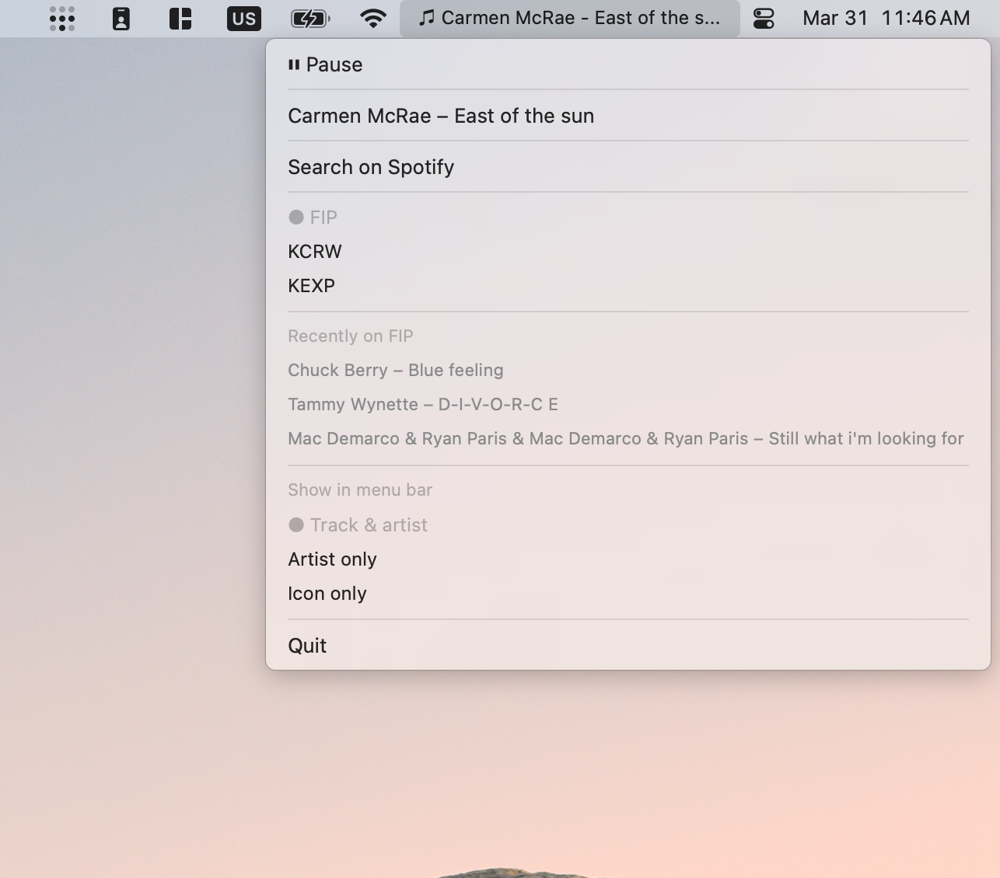

# Radio La La

FIP, KCRW, and KEXP in your menu bar. Shows current track in Control Center with media key support.




## Install

```
brew install mpv socat jq
brew install --cask swiftbar
```

Clone this repo, then point SwiftBar's plugin folder at the `plugins/` directory (SwiftBar > Preferences > Plugin Folder). The `lib/` scripts are picked up automatically via relative paths.

## Radio.app

`Radio.app` is a launcher that starts playback and opens SwiftBar in one double-click. It is **not code-signed**, so macOS will block it on first launch. To open it:

> Right-click → Open → Open (or run `xattr -cr Radio.app` in the terminal first)

You don't need the app — you can use SwiftBar directly and call `lib/radio-ctl.sh play fip` from the terminal.

## Usage

Click the ♫ icon in the menu bar → pick a station.

```
lib/radio-ctl.sh play fip|kcrw|kexp   # start or switch station
lib/radio-ctl.sh pause                 # toggle pause
lib/radio-ctl.sh stop                  # stop playback
lib/radio-ctl.sh now                   # current track JSON
lib/radio-ctl.sh status                # playing|paused|stopped
```

## Troubleshooting

**No sound** — check `mpv` is installed and the stream URL is reachable.

**Nothing in Now Playing widget** — run `lib/radio-ctl.sh stop` then `play fip` again.

**SwiftBar not updating** — confirm SwiftBar's plugin folder is set to `plugins/` and `radio.2s.sh` is executable (`chmod +x plugins/radio.2s.sh`).
